<div align="center">


# MahaGuru AI

**From confusion to clarity.**
An open-source AI mentor and personalised classroom for college students.

[Live demo](https://mahaguru-ai.onrender.com) &nbsp;&middot;&nbsp;
[Architecture](docs/architecture.md) &nbsp;&middot;&nbsp;
[Deployment](docs/deployment.md) &nbsp;&middot;&nbsp;
[Evaluation](docs/evaluation.md)

[](https://github.com/aviraj1805/MahaGuru-V1/actions/workflows/ci.yml)
[](LICENSE)


</div>

<p align="center">
  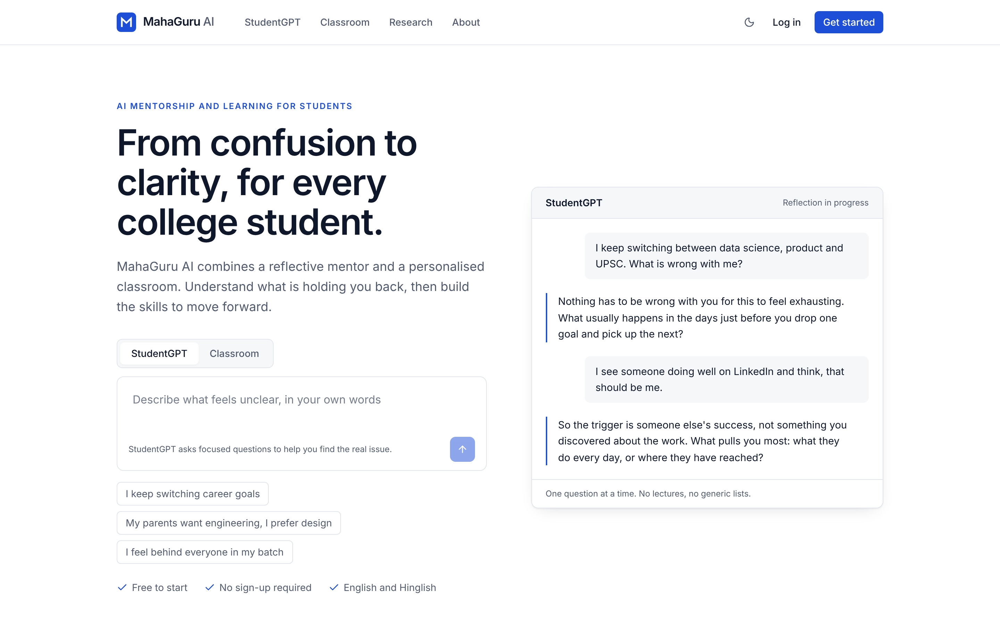
</p>

---

## Overview

Most AI tools for students jump straight to answers. MahaGuru AI is built around a different idea: a student who is confused about their direction first needs to understand *why*, and only then needs a plan. The platform pairs two products that hand off to each other.

| Product | Purpose | What the student gets |
|---|---|---|
| **StudentGPT** | Reflect | A mentor that asks before it answers. It helps the student find what sits underneath the confusion (fears, expectations, borrowed goals) and closes with a clarity summary they keep. |
| **Classroom** | Learn and execute | A learning goal turned into a personalised roadmap: a short diagnostic, modules and lessons written for the student's level, an AI teacher per lesson, practice quizzes, graded projects and progress that adapts. |

A clarity summary can propose a learning goal, and one click turns it into a Classroom.

> **Live demo:** [mahaguru-ai.onrender.com](https://mahaguru-ai.onrender.com)
> Hosted on a free tier. The first visit after a period of inactivity can take up to a minute while the server wakes up, and AI requests are subject to a daily free quota. Demo data may be reset at any time.

## Screenshots

### Homepage

<p align="center">
  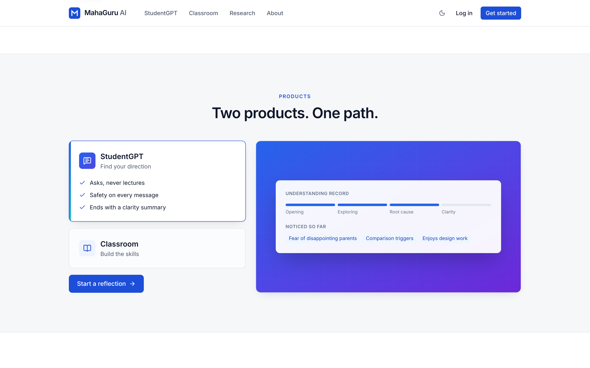
</p>
<p align="center"><sub>An interactive product switcher with animated previews of StudentGPT and Classroom</sub></p>

### StudentGPT

<table>
  <tr>
    <td width="50%">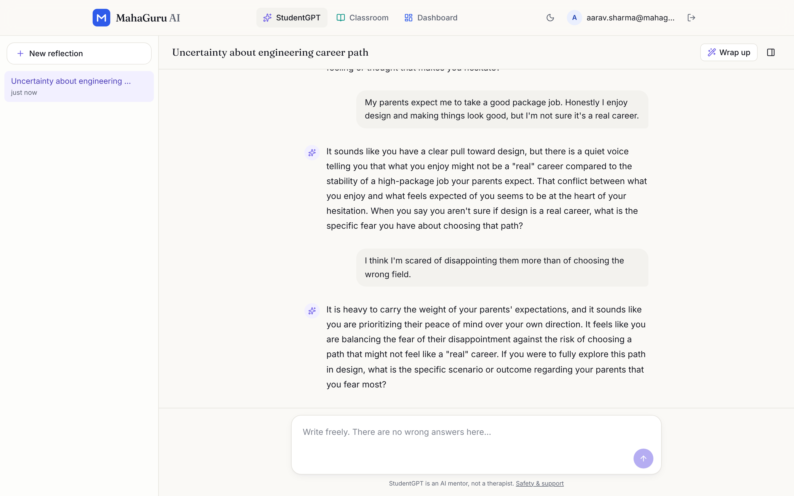</td>
    <td width="50%">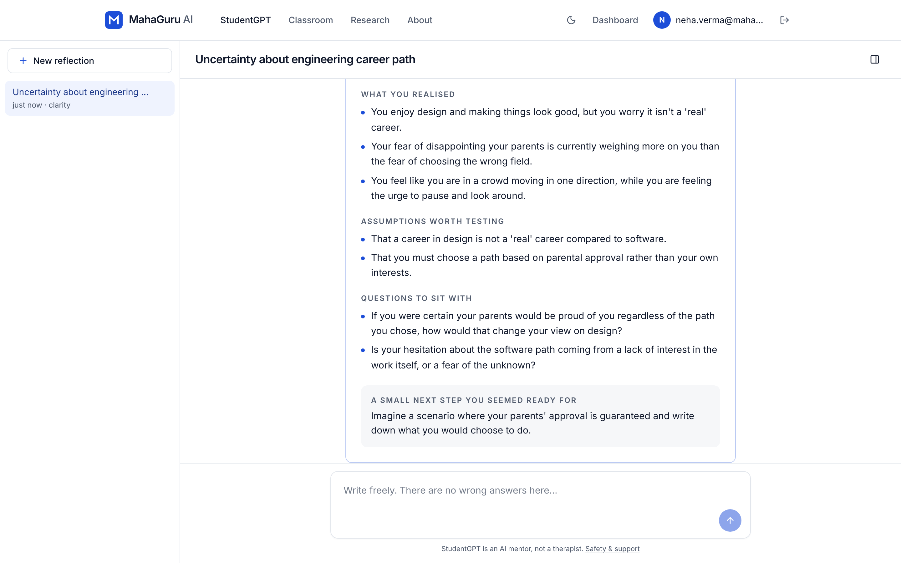</td>
  </tr>
  <tr>
    <td align="center"><sub>A reflective conversation: one thoughtful question at a time</sub></td>
    <td align="center"><sub>The clarity summary the student keeps</sub></td>
  </tr>
</table>

### Classroom

<table>
  <tr>
    <td width="50%">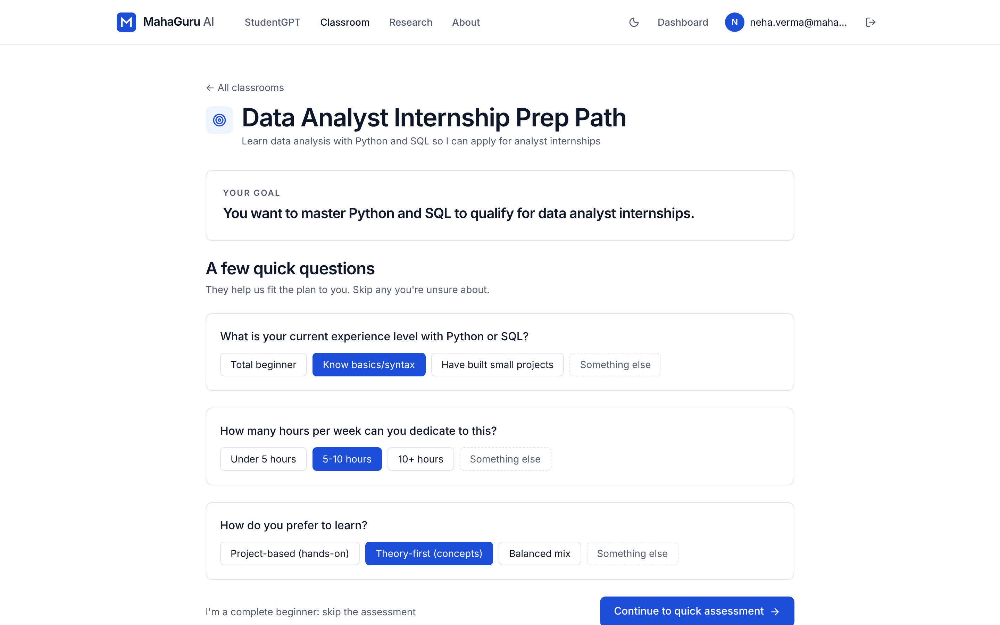</td>
    <td width="50%">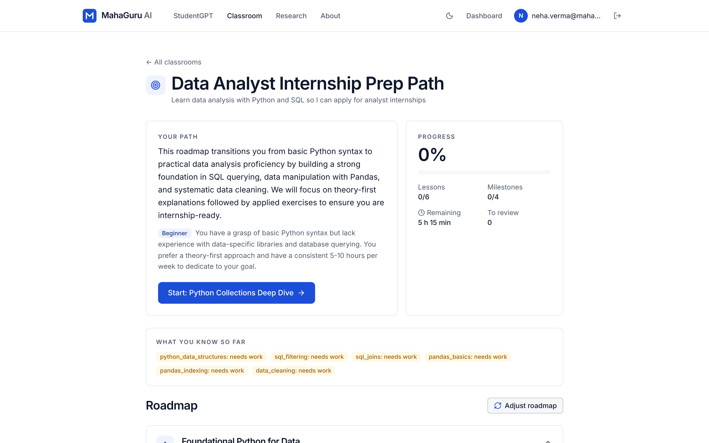</td>
  </tr>
  <tr>
    <td align="center"><sub>Clarifying questions fit the plan to the student</sub></td>
    <td align="center"><sub>A personalised, versioned roadmap with progress</sub></td>
  </tr>
  <tr>
    <td width="50%">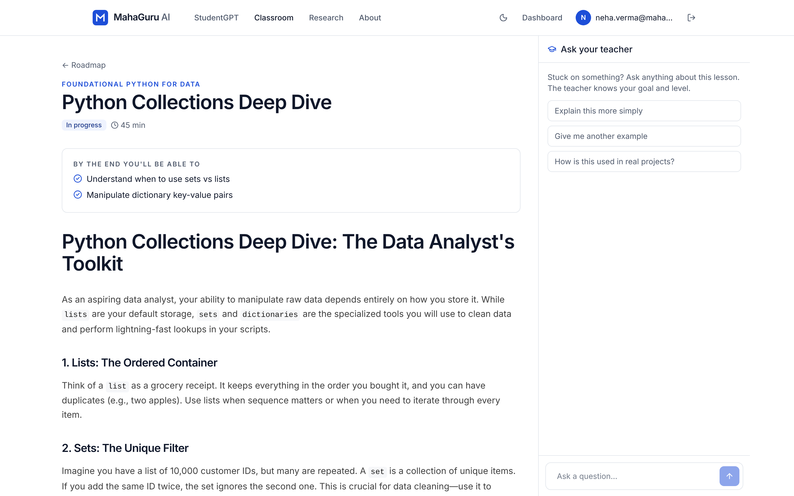</td>
    <td width="50%">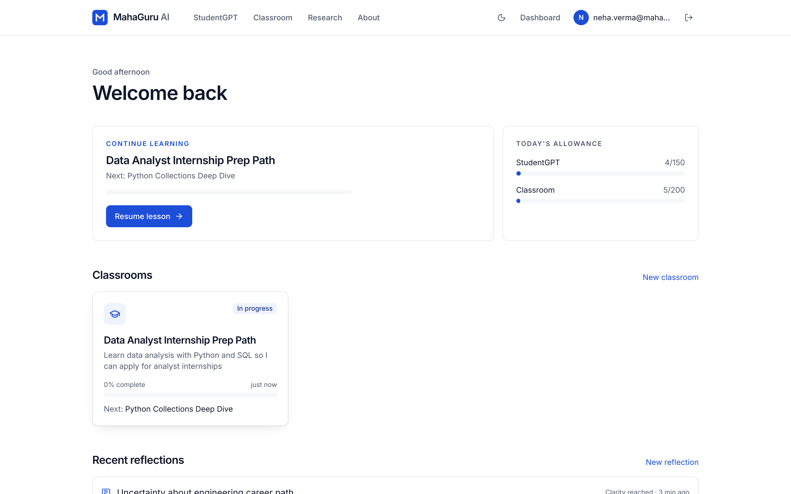</td>
  </tr>
  <tr>
    <td align="center"><sub>Lessons written for the student's level, with an AI teacher</sub></td>
    <td align="center"><sub>Dashboard: reflections, classrooms and where to continue</sub></td>
  </tr>
</table>

### Research and company pages

<table>
  <tr>
    <td width="50%">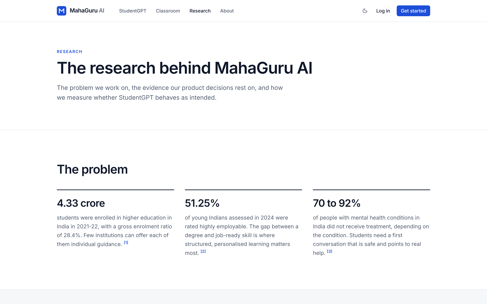</td>
    <td width="50%">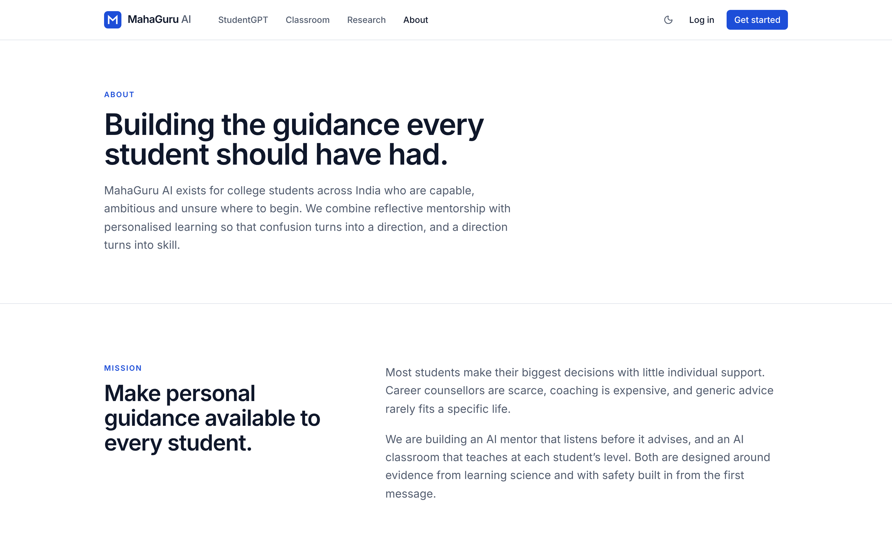</td>
  </tr>
  <tr>
    <td align="center"><sub>Research: sourced facts, principles from learning science and the evaluation method</sub></td>
    <td align="center"><sub>About: mission, beliefs and how to contribute</sub></td>
  </tr>
</table>

### Dark theme and mobile

<table>
  <tr>
    <td width="64%">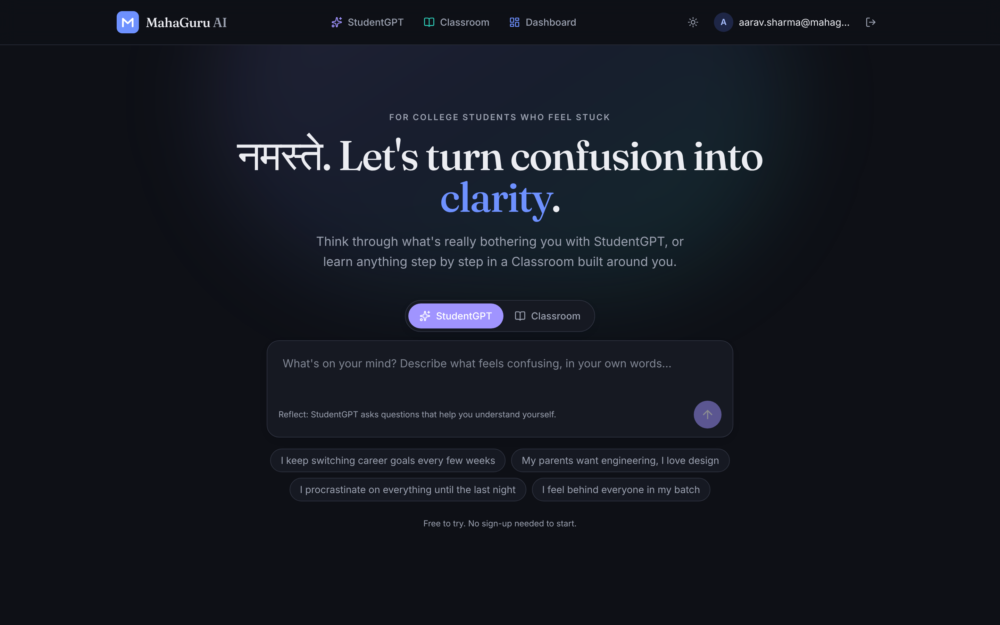</td>
    <td width="18%">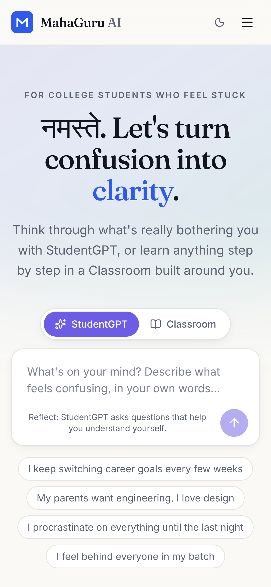</td>
    <td width="18%">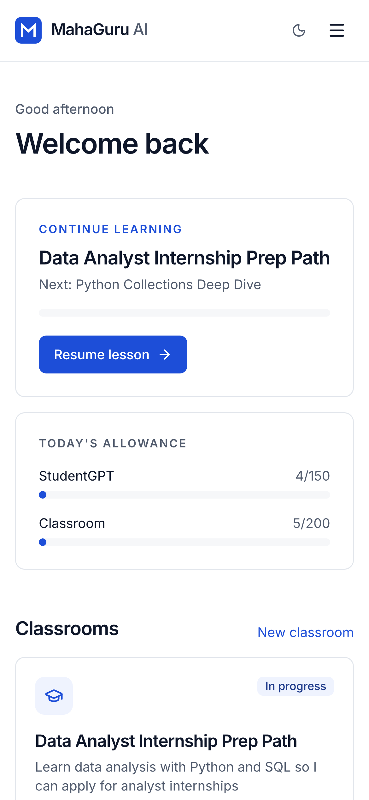</td>
  </tr>
</table>

## Features

### StudentGPT

- **Questions before advice.** Each reply reflects what the student said and asks one focused question, guided by a private *understanding record* (concern, context, beliefs, emotions, open threads, insights) that is updated after every turn.
- **Grounded in curated dialogues.** Two reference conversations are retrieved per turn from an authored dataset with BM25, with no extra API calls.
- **Safety first.** Every message passes a deterministic safety screen in English and Hinglish before the model replies. Signs of crisis switch the reply to a safety protocol and show helplines (Tele-MANAS 14416, emergency 112).
- **Streaming replies** over Server-Sent Events. Generation runs detached from the request, so a reply is saved even if the browser disconnects.
- **Clarity summary** on request: what the student came with, what sits underneath, insights in their own words, assumptions to test, and an optional next step.

### Classroom

- **Intake and diagnostic.** Clarifying questions, then a short assessment graded deterministically (multiple choice) or against a rubric (short answers). Answer keys never reach the browser.
- **Personalised roadmap** of 3 to 6 modules with objectives, concepts, durations and milestones, stored as versioned revisions.
- **Lessons** generated on first open and cached: hook, explanation, worked example, common mistakes, self-check and key takeaways.
- **AI teacher** per lesson that knows the student's goal, profile, weak concepts and progress.
- **Practice and projects.** Quizzes that prioritise weak concepts, and milestone projects graded against a rubric.
- **Adaptive progress.** Per-concept mastery, targeted re-explanations when a quiz is below 70 percent, and roadmap revisions shown as proposals the student approves.
- **Vetted resources.** Suggested links are restricted to trusted domains and checked for reachability.

### Homepage and website

- **Live product demo in the hero.** A StudentGPT conversation types itself out, and visitors can switch between three scenarios (career confusion, family pressure, and lost motivation in Hinglish).
- **Motion with a purpose.** Animated gradient lighting, a scrolling marquee of real student topics, statistics that count up on scroll, a product switcher with animated previews, and a process timeline that draws itself.
- **Short, direct copy.** Each section leads with a visual and a single line rather than paragraphs.
- **Sourced facts.** Every statistic links to its primary source (Ministry of Education, India Skills Report, NIMHANS, Bloom 1984).
- **Research and About pages.** The learning-science principles behind each feature, the evaluation method, stated limitations, a reference list, the mission and how to contribute.
- **Respectful motion.** All animation is switched off for visitors who prefer reduced motion, and the layout adapts to phones, tablets and desktops.

### Platform

- **Use without signing up.** Guests get a limited daily allowance; signing up keeps everything they created.
- Email and password accounts with Argon2 hashing, revocable server-side sessions, CSRF protection and per-user daily quotas.
- One token-based design system across the app, with light and dark themes and a single brand colour.
- **Provider-agnostic AI layer:** Google Gemini by default, or any OpenAI-compatible endpoint (Groq, OpenRouter, a local Ollama). Structured outputs are validated with Pydantic and repaired once before anything is saved.

## Site map

| Route | Page |
|---|---|
| `/` | Homepage with the live demo and product overview |
| `/reflect` | StudentGPT conversations and clarity summaries |
| `/learn` | Classroom: goals, roadmaps, lessons and practice |
| `/dashboard` | Ongoing reflections, classrooms and daily allowance |
| `/research` | Sourced facts, principles, evaluation method and references |
| `/about` | Mission, beliefs and contributing |
| `/safety`, `/privacy` | Helplines, safety design and data handling |
| `/login`, `/signup`, `/account` | Accounts, with guest work carried over on sign-up |

## Tech stack

| Layer | Technology |
|---|---|
| Frontend | React 18, TypeScript, Vite, Tailwind CSS (custom animation keyframes, no animation library), TanStack Query, React Router |
| Backend | Python, FastAPI, SQLAlchemy 2 (async), Alembic, Pydantic v2 |
| Database | PostgreSQL in production, SQLite for zero-setup local development |
| AI | Google Gemini (`gemini-3.5-flash-lite` by default) or any OpenAI-compatible API |
| Testing | pytest (SQLite and PostgreSQL), Vitest, Playwright end-to-end on desktop and mobile |
| Delivery | Single Docker image, GitHub Actions CI, Render blueprint |

## Architecture

```
Browser (React SPA)
   |  same-origin HTTPS, JSON, Server-Sent Events for streamed replies
   v
FastAPI (one process; also serves the built SPA)
   |-- routes/        auth, studentgpt, classroom, dashboard, health
   |-- services/
   |     llm/         provider interface: Gemini | OpenAI-compatible | offline fake (tests)
   |     studentgpt/  safety screen -> prompt (record + exemplars) -> stream -> state update
   |     classroom/   intake, diagnostic, roadmap, lessons, grading, adaptation, resources
   |     quota.py     per-user rolling 24-hour allowances
   v
SQLAlchemy 2 (async) --> PostgreSQL (SQLite locally)
```

The frontend is built into static files and served by the same FastAPI process, so the whole product deploys as one service with no cross-origin cookies. Details are in [docs/architecture.md](docs/architecture.md).

## Getting started

### Prerequisites

- Python 3.11 or newer and [uv](https://docs.astral.sh/uv/)
- Node.js 20 or newer
- A free Gemini API key from [Google AI Studio](https://aistudio.google.com/apikey) (optional, see offline mode below)

### Run locally

```bash
git clone https://github.com/aviraj1805/MahaGuru-V1.git
cd MahaGuru-V1

# 1. API
cd apps/api
cp .env.example .env              # set GEMINI_API_KEY
uv sync
uv run alembic upgrade head
uv run uvicorn app.main:app --reload --port 8000

# 2. Web (in a second terminal)
cd apps/web
npm install
npm run dev                        # http://localhost:5173, proxies /api to :8000
```

**Offline mode.** Without an API key, set `LLM_PROVIDER=fake` in `apps/api/.env` to click through the whole product with placeholder replies. A banner makes this clear, and the mode is refused in production.

### Run with Docker

```bash
GEMINI_API_KEY=your-key docker compose up --build
```

This starts PostgreSQL and the app on http://localhost:8000.

## Configuration

| Variable | Required | Default | Purpose |
|---|---|---|---|
| `ENV` | production | `development` | `production` enables strict checks and secure cookies |
| `SECRET_KEY` | yes | development value | At least 32 random characters in production |
| `DATABASE_URL` | yes | SQLite file | PostgreSQL URL in production |
| `LLM_PROVIDER` | | `gemini` | `gemini`, `openai_compat`, or `fake` (not allowed in production) |
| `GEMINI_API_KEY` | with Gemini | | Kept server-side, never sent to the browser |
| `LLM_MODEL` / `LLM_FAST_MODEL` | | `gemini-3.5-flash-lite` | Models for conversation and for structured tasks |
| `OPENAI_BASE_URL` / `OPENAI_API_KEY` | with `openai_compat` | | Any OpenAI-compatible endpoint |
| `WEB_ORIGIN` | | `http://localhost:5173` | Public site URL |

The full list, including quota settings, is in [docs/deployment.md](docs/deployment.md).

## Testing

```bash
cd apps/api && uv run pytest                      # API, engines, LLM layer, migrations
cd apps/web && npm test                           # unit tests
cd apps/web && npm run build && npm run e2e       # Playwright journeys, desktop and mobile
```

Tests use a deterministic offline AI provider, so they are free and repeatable. CI runs the API suite on both SQLite and PostgreSQL, checks that migrations apply to a fresh database, runs the end-to-end journeys and builds the Docker image. The behaviour of the real model is measured separately with the [StudentGPT evaluation harness](docs/evaluation.md).

## Deployment

The repository includes a [Render blueprint](render.yaml) for a free deployment:

1. Create a free PostgreSQL database (for example on [Neon](https://neon.tech)) and copy its connection string.
2. In Render, choose **New, Blueprint** and select this repository.
3. Set `DATABASE_URL`, `GEMINI_API_KEY` and `WEB_ORIGIN`. `SECRET_KEY` is generated for you.
4. Deploy. The container applies migrations on start and exposes a health check at `/api/health`.

Step-by-step instructions, alternatives and free-tier limits are in [docs/deployment.md](docs/deployment.md).

## Project structure

```
apps/
  api/                      FastAPI backend
    app/api/routes/         auth, studentgpt, classroom, dashboard
    app/services/llm/       provider abstraction, Gemini, OpenAI-compatible, offline fake
    app/services/studentgpt safety screen, understanding record, exemplar retrieval, prompts
    app/services/classroom  intake, diagnostic, roadmap, lessons, grading, adaptation
    alembic/                database migrations
    scripts/                dataset build, dialogue generation, evaluation
    tests/
  web/                      React app
    src/pages/              homepage, research, about, dashboard, auth and info pages
    src/features/           studentgpt and classroom
    src/components/         layout shell, UI primitives, marketing motion helpers
    e2e/                    Playwright journeys
data/studentgpt/            authored dialogue dataset and evaluation scenarios
docs/                       architecture, dataset, evaluation, deployment, decisions
```

## Documentation

| Document | Contents |
|---|---|
| [Architecture](docs/architecture.md) | How both products work, the data model and the API |
| [StudentGPT dataset](docs/dataset.md) | The authored dialogue dataset and how to extend it |
| [Evaluation](docs/evaluation.md) | How StudentGPT's behaviour is measured |
| [Deployment](docs/deployment.md) | Free hosting, environment variables, secrets and monitoring |
| [Decisions](docs/decisions.md) | Key technical choices and their trade-offs |

## Project status

MahaGuru AI is an open-source project in public beta, and the live demo is a showcase deployment.

| Area | Status |
|---|---|
| StudentGPT and Classroom | Complete and covered by API, unit and end-to-end tests |
| Website | Interactive homepage, plus Research, About, Safety and Privacy pages |
| Demo hosting | Render free tier. The database resets when the service restarts. Use PostgreSQL ([Neon](https://neon.tech)) for persistent data. |
| Model evaluation | Harness and 24 scenarios in place. Full results will be published in [docs/evaluation.md](docs/evaluation.md). |
| Next steps | Publish evaluation results, set up a persistent database for the demo, and add more Indian languages to safety screening |

## Safety and responsible use

StudentGPT is a mentor for reflection. It is **not** a therapist, counsellor or medical service. Every message is screened before the model replies, and if there are signs of crisis the conversation switches to a safety protocol and shows helplines. Safety events record only a level and category, never the message text. The platform is intended for users aged 18 and above.

If you are in crisis in India, call Tele-MANAS at **14416** or emergency services at **112**.

## Contributing

Contributions are welcome. Please open an issue to discuss a substantial change before sending a pull request, and make sure `uv run ruff check`, `uv run pytest` and the web tests pass locally.

## License

Released under the [MIT License](LICENSE).
